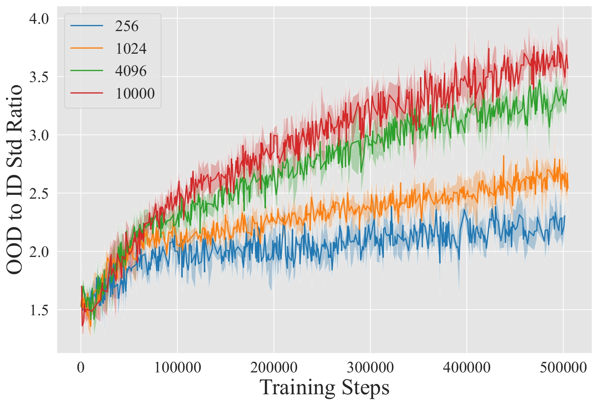
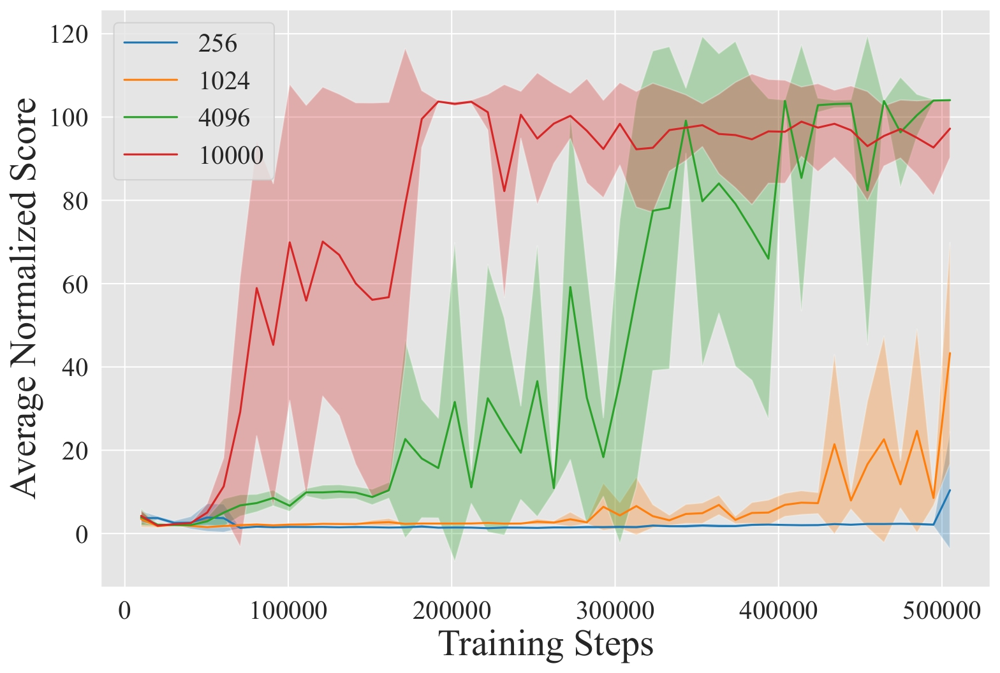

# Q-ensemble for Offline RL: Don't Scale the Ensemble, Scale the Batch Size

<p float="left">
  
  
</p>

This repository contains the official implementation of
[Q-ensemble for Offline RL: Don't Scale the Ensemble, Scale the Batch Size](https://arxiv.org/abs/2211.11092).

## Dependencies & Docker setup

To set up python environment (with tool on your taste, in our research we use conda and python 3.8), 
just install all requirements:
```commandline
python install -r requirements.txt
```
However, with such setup, you would also need to install mujoco210 binaries by hand. Sometimes this is not straightforward,
but we used this recipe:
```commandline
mkdir -p /root/.mujoco \
    && wget https://mujoco.org/download/mujoco210-linux-x86_64.tar.gz -O mujoco.tar.gz \
    && tar -xf mujoco.tar.gz -C /root/.mujoco \
    && rm mujoco.tar.gz
export LD_LIBRARY_PATH=/root/.mujoco/mujoco210/bin:${LD_LIBRARY_PATH}
```
You may also need to install additional dependencies for mujoco_py. 
We recommend following the official guide from [mujoco_py](https://github.com/openai/mujoco-py).

### Docker

We also provide a simpler way, with a dockerfile that is already set up to work, all you have to do is build and run it :)
```commandline
docker build -t lb_sac .
```
To run, mount current directory:
```commandline
docker run -it \
    --gpus=all \
    --rm \
    --volume "<PATH_TO_THE_REPO>/lb-sac:/workspace/lb-sac" \
    --name lb_sac \
    lb_sac bash
```

## How to reproduce experiments
Configs are stored in `configs/<algo_name>/<task_type>`. All available hyperparatemers are listed in `train.py`.
For example, to start EDAC training on `halfcheetah-medium-v2`:
```commandline
python train.py \
    --config_path="configs/edac/halfcheetah/halfcheetah_medium.yaml" \
    --device=cuda
```
You can also use our simple tool for sweeps and multiseed training (same can be done with wandb sweep):
```commandline
python sweep.py \
    --command "python train.py" \
    --configs "configs/edac/*" \
    --num_seeds 4 \
    --num_gpus 8
```
This will run each config for 4 seeds on all available gpus in the queue (8 at max).

# Citing

If you use this code for your research, please consider citing the paper:
```
@article{nikulin2022q,
  title={Q-Ensemble for Offline RL: Don't Scale the Ensemble, Scale the Batch Size},
  author={Nikulin, Alexander and Kurenkov, Vladislav and Tarasov, Denis and Akimov, Dmitry and Kolesnikov, Sergey},
  journal={arXiv preprint arXiv:2211.11092},
  year={2022}
}
```
